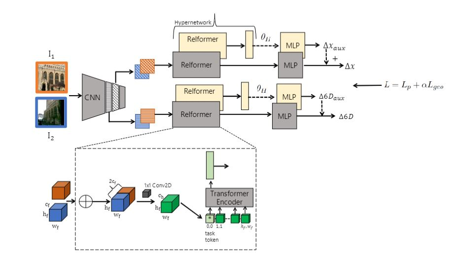

## Improving the Zero-Shot Localization of Relative Pose Regressors
Official PyTorch implementation of our paper: Improving the Zero-Shot Localization of Relative Pose Regressors.

We implement our method using a hybrid CNN-Transformer architecture (Relformer), which is illustrated in the figure below. 
We apply a shared convolutional backbone to extract feature maps from image pairs with two separate branches to predict the translation and rotation parameters, respectively. Feature maps are first concatenated, linearly projected and flattened. They are passed to respective branches with a correspondig 2D learned position encoding. Each branch is implemented with a Transformer Encoder and an MLP head. The Transformer Encoders aggregate paired feature maps into a latent representation of the pose parameters, learned using a dedicated task token. Each MLP head regresses its target (∆x or ∆6D) from the respective latent code at the position of the token.  In order to improve the adaptability of the regressor MLPs to new environments, two hypernetwork branches (yellow) learn the weights of auxiliary MLP heads, which refine the estimate of the main branch (in grey) with the residuals.


---

### Repository Overview 

This code implements:

1. Training of a multiple architectures for multi-scene relative pose regression 
2. Testing code

---

### Prerequisites

In order to run this repository you will need:

1. Python3 (tested with Python 3.7.7, 3.8.5), PyTorch
2. Set up dependencies with ```pip install -r requirements.txt```
3. Download the [Cambridge Landmarks](http://mi.eng.cam.ac.uk/projects/relocalisation/#dataset) dataset and the [7Scenes](https://www.microsoft.com/en-us/research/project/rgb-d-dataset-7-scenes/) dataset

---

### Pretrained models:
You can download our pretrained models for the 7Scenes dataset (trained over all scenes / without fire scene), from here: 

1. relformer_all.pth: model trained with config/7scenes_config.json over 7Scenes dataset including all scenes
2. relformer_nofire.pth: model trained with config/7scenes_config.json over 7Scenes dataset over 6 scenes while 'fire' scene kept out of training

### Usage
Training 
```
python main.py --mode train --dataset_path /media/yoli/WDC-2.0-TB-Hard-/7Scenes --rpr_backbone_path models/backbones/efficient-net-b0.pth --labels_file datasets/7Scenes/7scenes_training_pairs.csv --config_file config/7scenes_config.json --gpu 0
```
Testing
```
python main.py --mode test --dataset_path /media/yoli/WDC-2.0-TB-Hard-/7Scenes --rpr_backbone_path models/backbones/efficient-net-b0.pth --test_labels_file datasets/7Scenes/7scenes_test_NN/NN_7scenes_chess.csv --config_file config/7scenes_config.json --checkpoint_path checkpoints/relformer_all.pth --gpu 0
```


### Configurations  (under './config'):

7scenes_config.json: all features enabled (feature matching, transformer encoder, orientation representation is 6d, reprojection loss, hyper-network

7scenes_config_deltanet_baseline.json: no feature matching between query and reference images, orientation representation is quaternion

7scenes_config_deltanet_conv.json: feature matching between query and reference images is convolution, orientation representation is quaternion

7scenes_config_deltanet_transformer_encoder: feature matching between query and reference images is transformer encoder, orientation representation is quaternion

7scenes_config_deltanet_transformer_encoder_6d: feature matching between query and reference images is transformer encoder, orientation representation is 6d 

7scenes_config_deltanet_transformer_encoder_9d: feature matching between query and reference images is transformer encoder, orientation representation is 9d 

7scenes_config_deltanet_transformer_encoder_10d: feature matching between query and reference images is transformer encoder, orientation representation is 10d 
 
